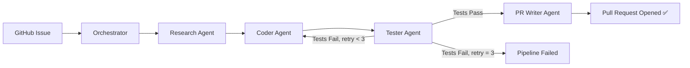

# 🤖 Multi-Agent Software Engineering System

> A **LangGraph-powered multi-agent pipeline** that autonomously resolves GitHub issues — researches the codebase, writes a fix, generates tests, validates them in a Docker sandbox, and opens a pull request. **Zero human intervention.**


---

## 🏗️ Architecture



### Agent Roles

| Agent | Model | Role |
|-------|-------|------|
| **Orchestrator** | — | Parses issue URL, fetches issue details, manages pipeline state |
| **Research Agent** | Gemini 2.0 Flash | Searches repo, reads files, identifies bug location |
| **Coder Agent** | Gemini 2.0 Flash | Writes minimal, targeted fix in unified diff format |
| **Tester Agent** | Gemini 2.0 Flash | Generates pytest tests, runs them in Docker sandbox |
| **PR Writer Agent** | Gemini 2.0 Flash | Creates branch, commits fix, opens professional PR |

### State Machine

All agents read from and write to a **shared `PipelineState`** object — like a shared whiteboard. This makes every agent independently testable and the entire pipeline debuggable.

---

## 🚀 Quick Start

### 1. Clone and install

```bash
git clone https://github.com/your-username/multi-agent-dev-system.git
cd multi-agent-dev-system
python -m venv venv
venv\Scripts\activate        # Windows
# source venv/bin/activate   # macOS/Linux
pip install -r requirements.txt
```

### 2. Configure environment

```bash
cp .env.example .env
# Edit .env with your actual keys
```

**Required keys:**

| Variable | Where to get it |
|----------|----------------|
| `GOOGLE_API_KEY` | [Google AI Studio](https://aistudio.google.com/app/apikey) |
| `GITHUB_TOKEN` | [GitHub Settings → Tokens](https://github.com/settings/tokens) — scopes: `repo` (read+write) |

**Optional (recommended):**

| Variable | Purpose |
|----------|---------|
| `LANGCHAIN_TRACING_V2=true` | Enable LangSmith tracing |
| `LANGCHAIN_API_KEY` | [LangSmith](https://smith.langchain.com) |
| `LANGCHAIN_PROJECT` | Groups traces (default: `multi-agent-dev-system`) |

### 3. Start Docker Desktop

The Tester Agent runs code inside a Docker container for safety. Make sure Docker Desktop is running.

```bash
# Build the sandbox image
docker build -t rag-sandbox -f docker/Dockerfile.sandbox .
```

### 4. Run the pipeline

```bash
python main.py --issue https://github.com/owner/repo/issues/42
```

### 5. Or use the REST API

```bash
# Start server
uvicorn src.api.main:app --reload --port 8000

# Trigger pipeline
curl -X POST http://localhost:8000/run \
  -H "Content-Type: application/json" \
  -d '{"issue_url": "https://github.com/owner/repo/issues/42"}'

# Poll status
curl http://localhost:8000/status/<run_id>

# Health check
curl http://localhost:8000/health
```

---

## 📁 Project Structure

```
multi-agent-dev-system/
├── main.py                     # CLI entry point
├── config.py                   # All constants & health checks
├── requirements.txt            # Dependencies
├── .env.example                # Environment template
├── docker/
│   └── Dockerfile.sandbox      # Docker image for safe testing
├── src/
│   ├── agents/
│   │   ├── orchestrator.py     # Manager — parses issue, routes agents
│   │   ├── researcher.py       # Searches repo, identifies bug files
│   │   ├── coder.py            # Writes targeted code fix
│   │   ├── tester.py           # Generates tests, runs in sandbox
│   │   └── pr_writer.py        # Creates branch, commits, opens PR
│   ├── tools/
│   │   └── github_tools.py     # PyGithub API wrappers (7 functions)
│   ├── state/
│   │   └── state.py            # PipelineState Pydantic model
│   ├── graph/
│   │   └── pipeline.py         # LangGraph StateGraph definition
│   ├── sandbox/
│   │   └── docker_runner.py    # Docker sandbox manager
│   ├── prompts/
│   │   ├── researcher.txt      # Research Agent system prompt
│   │   ├── coder.txt           # Coder Agent system prompt
│   │   ├── tester.txt          # Tester Agent system prompt
│   │   └── pr_writer.txt       # PR Writer Agent system prompt
│   └── api/
│       └── main.py             # FastAPI REST endpoints
├── tests/
│   └── test_pipeline.py        # Unit tests (no API calls needed)
└── .github/
    └── workflows/
        └── ci.yml              # GitHub Actions CI
```

---

## 🧪 Running Tests

```bash
pytest tests/ -v
```

Tests verify:
- ✅ `PipelineState` model validation
- ✅ URL parsing (valid/invalid GitHub URLs)
- ✅ Routing: `route_after_orchestrator()` — researcher vs END
- ✅ Routing: `route_after_tester()` — pr_writer vs coder retry vs END
- ✅ Pytest output parsing (pass/fail/error/empty)
- ✅ Config health checks

---

## 🔍 Observability (LangSmith)

Once `LANGCHAIN_TRACING_V2=true` and `LANGCHAIN_API_KEY` are set, **all agent calls are automatically traced**. In the LangSmith dashboard you can see:

- Full trace of every agent invocation in order
- Exact prompt sent to each agent
- Exact response from each agent
- Tool calls and their results
- Token usage and cost per agent
- Total pipeline latency
- Retry count and failure reasons

---

## 🐳 Docker Security

The sandbox container runs AI-generated code with these constraints:

| Flag | Purpose |
|------|---------|
| `--network none` | No internet access |
| `--memory 256m` | Max 256MB RAM |
| `--cpus 0.5` | Max half a CPU core |
| `--rm` | Auto-deleted after run |
| `--read-only` (workspace only) | Only `/workspace` is writable |

---

## 💡 Interview Talking Points

**Why LangGraph, not plain LangChain?**
> LangChain chains are linear — A→B→C. Agent systems need conditional branching and cycles (retry loops). LangGraph models the pipeline as a graph with conditional edges.

**Why Docker sandbox?**
> The Tester Agent runs AI-generated code. Docker provides isolation — no network, memory limits, auto-cleanup. Essential for production safety.

**Why shared state pattern?**
> Each agent is stateless — reads/writes a shared PipelineState. This makes agents independently testable and the pipeline fully debuggable.

**What makes retry logic hard?**
> Naive retries just re-run the Coder. The right approach passes the specific `failure_reason` so the Coder makes a targeted fix, not a random guess.

---

## 📝 Resume Bullet

> Built production multi-agent software engineering system using LangGraph — orchestrates specialised Research, Coder, Tester, and PR Writer agents with stateful conditional retry logic and Docker sandboxing; system autonomously resolves GitHub issues and opens pull requests end-to-end.

---

## 📄 License

MIT
